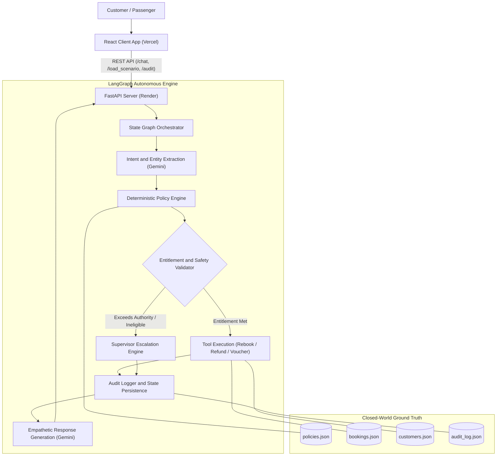

# AirResolve AI — Autonomous Airline Disruption Resolution Agent

[](https://air-resolve-aionos.vercel.app/)
[](https://render.com/)
[](https://python.langchain.com/)

AirResolve AI is an autonomous, customer-facing airline disruption resolution agent built for the AIONOS Agentic AI Factory Assignment. It combines LLM-driven conversational empathy and intent extraction with a strictly deterministic policy engine and hard guardrails to resolve flight cancellations, delays, rebookings, meal vouchers, and refunds with zero hallucinations.

---

## Live Deployment

- Live Web Application (Frontend): [https://air-resolve-aionos.vercel.app/](https://air-resolve-aionos.vercel.app/)
- Backend Service: Hosted on Render (FastAPI + LangGraph + Google Gemini)

---

## System Flowchart & Architecture



For comprehensive details on graph state structure, tools, and policy definitions, refer to [`docs/architecture.md`](file:///c:/Users/harsh/OneDrive/Documents/Costumer%20Support%20Agent/airresolve-ai/docs/architecture.md).

---

## Key Features and Capabilities

- **Strict Closed-World Adherence**: Operates solely on ground-truth customer records, live booking statuses, and airline policy files.
- **Deterministic Policy Engine**: Compensation calculations, meal vouchers, hotel entitlements, and waiver rules are computed deterministically in code, preventing LLM arithmetic errors or policy drift.
- **Hard Guardrails and Automated Escalation**:
  - Fare differences exceeding Rs 1,500 automatically escalate to a human supervisor.
  - Non-airline disruptions (e.g. severe weather, air traffic control restrictions) strictly withhold cash compensation while offering statutory care.
  - Formal complaints and legal claims trigger escalation with audit records.
- **Real-Time Context Panel**: The user interface displays customer tier, booking PNR status, calculated policy entitlements, and executed tool actions in real time.
- **Interactive Scenarios**: Instant one-click testing for target personas:
  1. **Priya Nair (PNR: SK4821X)**: Airline technical cancellation (eligible for full refund / rebooking + meal voucher).
  2. **Arvind Kulkarni (PNR: TR1190B)**: Severe weather cancellation (eligible for rebooking / refund, non-airline cause restricts cash compensation).
  3. **Meher Kaur (PNR: WL7742)**: 6-hour operational delay (eligible for meal voucher, lounge access, hotel accommodation, and compensation).

---

## Tech Stack

- **Frontend**: React 18, Vite, Tailwind CSS, Lucide Icons (Deployed on Vercel)
- **Backend API**: FastAPI, Pydantic, Uvicorn (Deployed on Render)
- **Agent Framework**: LangGraph, LangChain Core, `langchain-google-genai` (Google Gemini)
- **Testing**: Pytest

---

## Local Development Setup

### 1. Backend

```bash
cd backend
python -m venv venv

# Activate virtual environment:
# Windows:
.\venv\Scripts\activate
# macOS/Linux:
source venv/bin/activate

pip install -r requirements.txt

# Create .env file with your API key
echo GOOGLE_API_KEY=your_gemini_api_key > .env

# Run FastAPI server
python main.py
```
The backend will run on `http://localhost:8000`.

### 2. Frontend

```bash
cd frontend
npm install
npm run dev
```
Open your browser at `http://localhost:5173`.

---

## Running Automated Tests

Run backend test suites:

```bash
cd backend
pytest tests/
```
