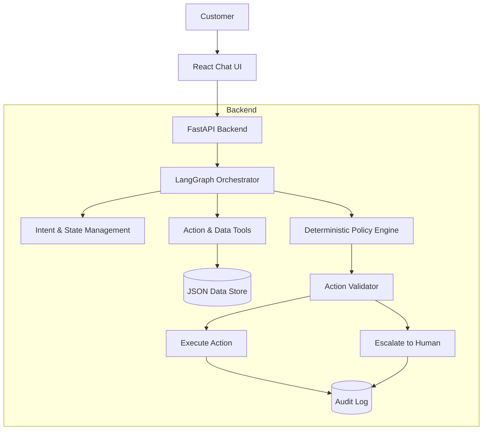

# Architecture: AirResolve AI

## System Overview

## Core Components

1. **Frontend (Vite + React + Tailwind CSS)**: 
   - A responsive, glassmorphic UI displaying the chat interface.
   - Includes real-time rendering of customer context, booking status, and agent actions.
   - Demo buttons allow quick loading of the 3 required scenarios.

2. **Backend API (FastAPI)**:
   - Exposes `/chat`, `/load_scenario`, and `/audit` endpoints.
   - Maintains an in-memory session store mapping `session_id` to LangGraph state.

3. **Agent Core (LangGraph + Gemini)**:
   - **Understand Intent**: The LLM parses the user message into JSON, extracting intents (e.g., `refund`, `hotel_accommodation`) and entities (e.g., `pnr`).
   - **Evaluate Policy**: The state transitions to a deterministic Python engine that calculates exact entitlements based on closed-world data.
   - **Validate Action**: The engine ensures the intent matches policy entitlements (guardrails). If not allowed, sets `requires_escalation`.
   - **Execute/Escalate**: Appropriate mock tools are called and audit records generated.
   - **Generate Response**: The LLM writes a final response explaining the situation empathetically.

4. **Data & Policy Layer (Deterministic)**:
   - Data is stored in `customers.json`, `bookings.json`, `policies.json`.
   - The Policy Engine strictly computes answers. The LLM cannot override this layer.

## Guardrails Implemented
- **No Hallucination**: LLM is instructed not to invent flights, transaction IDs, or hotels.
- **Strict Entitlement Limits**: Hotel only for >5h delays (delayed hours only). Fare waivers > ₹1500 require supervisor approval.
- **Escalation**: Formal complaints and legal threats automatically escalate.
